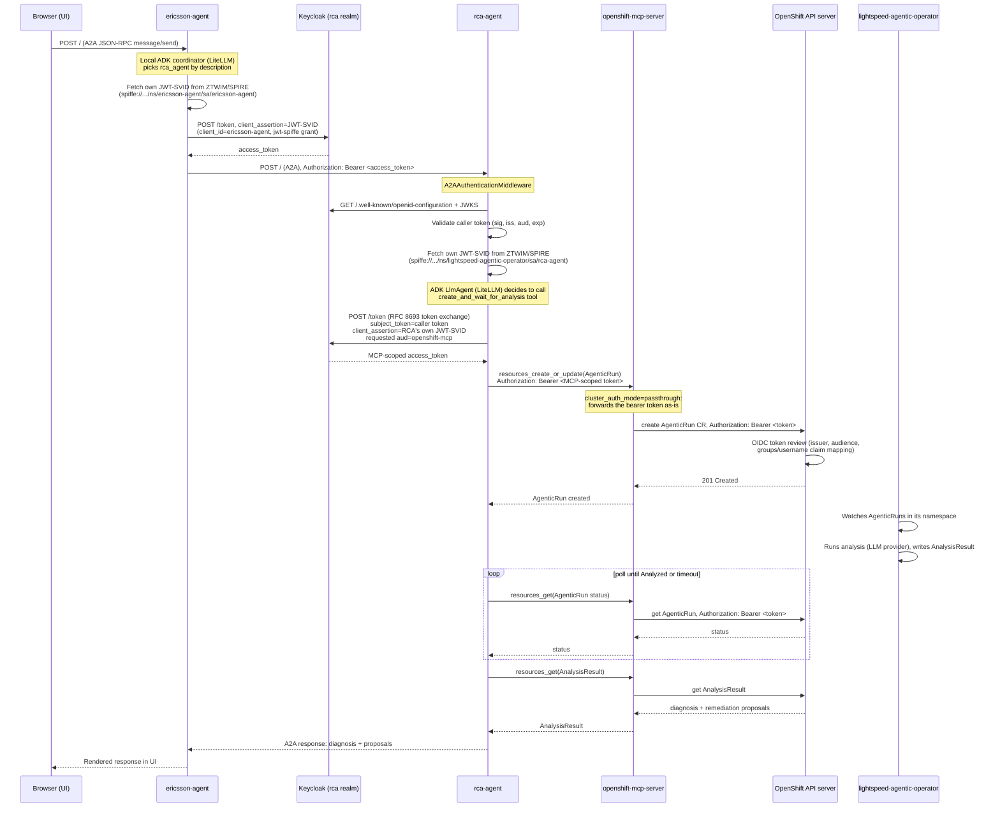

# Authentication flow: Ericsson UI to root-cause analysis

This documents the full per-request authentication path from a user typing a
message in the Ericsson agent's UI through to `rca_agent` triggering an
`AgenticRun` and returning a diagnosis. There is no single token used
end-to-end -- three separate Keycloak grants and one passthrough hop happen
per request, each with its own identity and failure mode.

## Two unrelated credential systems

It is easy to conflate these because both eventually show up as an
`Authorization` header somewhere, but they answer completely different
questions and must not be confused when debugging:

1. **LLM inference credentials (LiteLLM).** `LITELLM_API_KEY`/
   `LITELLM_API_BASE` (or provider-specific equivalents such as
   `OPENAI_API_KEY`). This is a **static, standing credential per
   deployment** -- every request from every user goes through the *same*
   key. It answers "how does this agent's own reasoning step (the ADK
   `LlmAgent`/`LiteLlm` call) authenticate to the model backend", and has
   nothing to do with who is asking or what they're allowed to do. If this
   is broken, the agent can't think at all -- it fails before ever deciding
   whether to call a tool or a downstream agent (see the `litellm.InternalServerError`
   / `Model ... not found` failures in Troubleshooting below, both entirely
   independent of Keycloak/SPIFFE).
2. **Workload/caller identity tokens (SPIFFE JWT-SVID + Keycloak).**
   Everything else in this document. This is **dynamic and per-request**: it
   answers "which identity authorizes this specific tool call or
   downstream-agent call, on behalf of whom". ericsson-agent authenticates
   to Keycloak as *itself* (its own SPIFFE identity) to call rca-agent;
   rca-agent then authenticates to Keycloak as *itself* again, but the token
   it requests carries the *original caller's* identity as the exchange
   subject, so the eventual `AgenticRun` is attributable to the caller, not
   to rca-agent's own service identity. This is the delegation chain that
   makes "on behalf of X" authorization possible, and it is what steps 2-5
   of the sequence below implement.

In short: the LiteLLM key decides *whether the agent can talk to its LLM at
all*; the SPIFFE/Keycloak chain decides *what the agent is allowed to do to
the cluster, and as whom*. A failure in one never explains a failure in the
other.

## Sequence



## The four Keycloak clients

Defined by `charts/all/keycloak-oidc`, in the `rca` realm. Conflating any of
these breaks the flow -- see that chart's README for the exact rationale.

| Client | Type | Used by | Purpose |
| --- | --- | --- | --- |
| `rca-agent` | public | Browser / `oc login` | Native OIDC login only. Also registered as the `cli` OIDC platform client. Cannot authenticate itself. |
| `openshift-console` | confidential | Web console | Registered as the `console` OIDC platform client. Needs the `groups` protocol mapper (see Troubleshooting) or RBAC group membership never reaches the console. |
| `ericsson-agent` | confidential | ericsson-agent | Client-credentials-style grant authenticated with ericsson-agent's own SPIFFE JWT-SVID (`client_assertion_type=urn:ietf:params:oauth:client-assertion-type:jwt-spiffe`) instead of a static secret. |
| `rca-agent-mcp` | confidential | rca-agent | RFC 8693 token exchange: takes the caller's token as `subject_token`, authenticates itself with its own SPIFFE JWT-SVID, and requests a token scoped to the `openshift-mcp` audience. |

The two confidential agent clients (`ericsson-agent`, `rca-agent-mcp`) both
need Keycloak's federated client authentication feature configured against
the `spiffe` identity provider -- this is a manual, one-time Admin Console
step (see `charts/all/keycloak-oidc/README.md`); it cannot be templated
because the exact fields are Keycloak-version-specific.

## Per-hop identity and validation

1. **User to ericsson-agent**: no authentication by default (`auth.mode` on
   the caller-facing side is out of scope here -- this doc covers the
   *downstream* auth ericsson-agent performs, not who's allowed to open the
   UI).
2. **ericsson-agent to rca-agent** (`agents/ericsson_agent/src/ericsson_agent/auth.py`,
   `DownstreamAuth`): fetches a JWT-SVID from the SPIFFE Workload API for
   audience `ericsson-agent`, uses it as `client_assertion` in a Keycloak
   token request for the confidential `ericsson-agent` client, and attaches
   the resulting access token as `Authorization: Bearer` on every outbound
   A2A request (`httpx` `event_hooks`).
3. **rca-agent validates the inbound token** (`agents/rca_agent/rca_agent/identity.py`,
   `A2AAuthenticationMiddleware`): every path except `/.well-known/agent-card.json`
   and `/health/ready` requires both (a) `KeycloakTokenValidator.validate` --
   signature via JWKS, issuer, and audience against `KEYCLOAK_ISSUER_URL`/
   `KEYCLOAK_AUDIENCES` -- and (b) `WorkloadIdentityProvider.get_identity` --
   RCA's own JWT-SVID must be obtainable at all, independent of the caller's
   token. Either failing returns a generic `401` (the specific cause is only
   in the pod logs, deliberately -- see Troubleshooting).
4. **rca-agent to OpenShift MCP** (`agents/rca_agent/rca_agent/mcp_agentic_run.py`
   + `identity.py`'s `KeycloakTokenExchanger`): the caller's *validated*
   token is used only as the `subject_token` of an RFC 8693 exchange -- it is
   never forwarded to MCP itself. RCA authenticates the exchange call with
   its own JWT-SVID as `client_assertion` on the confidential `rca-agent-mcp`
   client, requesting the `openshift-mcp` audience
   (`identity.keycloak.tokenExchange.audience`). The resulting MCP-scoped
   token is what actually gets sent to `openshift-mcp-server`.
5. **openshift-mcp-server to the API server**: `cluster_auth_mode=passthrough`
   means MCP does no authorization decision itself -- it forwards the
   MCP-scoped bearer token straight through to the Kubernetes API server as
   the caller's own credential. The API server's own OIDC authenticator (via
   `Authentication/cluster`) makes the actual RBAC decision. This means
   `openshift-mcp` **must** be one of `Authentication.spec.oidcProviders[].issuer.audiences`
   (`openshiftOIDC.extraAudiences` in `charts/all/keycloak-oidc`) or every
   MCP call is rejected at this hop even though the token exchange in step 4
   succeeded cleanly.
6. **AgenticRun -> AnalysisResult**: `lightspeed-agentic-operator` watches
   `AgenticRun` resources in its own namespace and writes `AnalysisResult`
   once analysis completes; RCA polls via the same MCP-scoped token from
   step 4 (short-lived -- the exchange happens once per request, not once
   per poll, so a very long-running analysis can outlive it).

## Tracing a live request

Each hop fails independently and mostly silently (generic `401`s are
deliberate), so trace hop-by-hop rather than end-to-end:

```bash
# 1. ericsson-agent's outbound call and its own SPIFFE fetch
oc logs -n ericsson-agent -l app.kubernetes.io/name=ericsson-agent -f

# 2. rca-agent's inbound validation, its own SPIFFE fetch, and the
#    token-exchange call
oc logs -n lightspeed-agentic-operator -l app.kubernetes.io/name=rca-agent -f

# 3. Keycloak's own record of every grant/exchange against a client --
#    enable this once: Admin Console -> Realm Settings -> Events -> Save Events
#    then Realm -> Sessions / Events, filtered by client (ericsson-agent,
#    rca-agent-mcp)

# 4. The passthrough hop -- MCP does no authz itself, so any 401/403 here
#    is really the API server rejecting the forwarded token
oc logs -n openshift-mcp-server -l app.kubernetes.io/name=openshift-mcp-server -f

# 5. What the API server currently trusts
oc get authentication.config.openshift.io cluster -o jsonpath='{.spec.oidcProviders[0].issuer.audiences}'

# 6. The operator side
oc get agenticrun -n lightspeed-agentic-operator
oc logs -n lightspeed-agentic-operator -l app.kubernetes.io/name=lightspeed-agentic-operator -f
```

## Troubleshooting (bugs actually hit building this)

- **`litellm.InternalServerError: ... Missing credentials`, or `Model
  openai/... not found`**: this is the *LLM inference* credential (see
  above), not the SPIFFE/Keycloak chain -- don't go looking in Keycloak
  Events for this one. `LiteLlm` forwards `**kwargs` straight to
  `litellm.completion()`, which does not read `LITELLM_API_BASE`/
  `LITELLM_API_KEY` on its own; those are this repo's own env var names, not
  something litellm auto-detects for the `openai/` model prefix (it only
  auto-reads `OPENAI_API_KEY`). Both `agent.py`s must pass them explicitly as
  `base_url=`/`api_key=` kwargs to `LiteLlm(...)` -- note the kwarg is
  `base_url`, not `api_base`.
- **RCA calls to MCP get 401 despite a successful token exchange**: check
  step 5 above -- `openshift-mcp` must be in the trusted audiences list, not
  just the two OIDC platform client IDs.
- **Console/CLI users authenticate but land in no RBAC groups**: the
  `openshift-console` client needs its own `groups` protocol mapper. It is
  easy to add the mapper only to the public login client (`rca-agent`) and
  forget the console has a separate client with its own, independent set of
  protocol mappers.
- **`/health/ready` stays `503` forever on either agent**: almost always the
  SPIFFE Workload API socket. The CSI driver always names the file
  `spire-agent.sock`, not `socket` -- check `identity.workloadApiSocket` /
  `identity.spiffe.workloadApiSocket` matches exactly what's mounted.
- **ericsson-agent logs `Failed to resolve remote A2A agent rca_agent: Agent
  card URL must use https, or http on a loopback host: http://rca-agent...`**:
  this is neither Keycloak nor SPIFFE -- google-adk's `RemoteA2aAgent` refuses
  to fetch an agent card (and, separately, refuses to trust the RPC url
  *inside* a card it did fetch) over plain http on a non-loopback host. The
  in-cluster Service DNS name is non-loopback plain http, so it no longer
  qualifies once a real caller in a different pod resolves it. Fix: put
  rca-agent behind its Route (`route.enabled`, edge TLS) and set
  `a2a.publicHost`/`a2a.publicPort`/`a2a.publicProtocol` (which control the
  RPC url the agent card itself advertises, in `rca_agent/main.py`) to that
  route's https origin, then point ericsson-agent's `a2a.downstreamEndpoint`
  at the same https origin instead of the in-cluster Service DNS name. The
  chart's `deployment.yaml` fails the template if `route.enabled` is true
  while `a2a.publicProtocol` is left at `http` to catch this early.
- **Confidential client authentication fails with no useful error**: the
  federated client authentication (jwt-spiffe) manual Admin Console step
  (see `charts/all/keycloak-oidc/README.md`) wasn't done, or `rca-agent-mcp`
  wasn't separately granted token-exchange permission for the
  `openshift-mcp` audience under Fine-Grained Admin Permissions.
