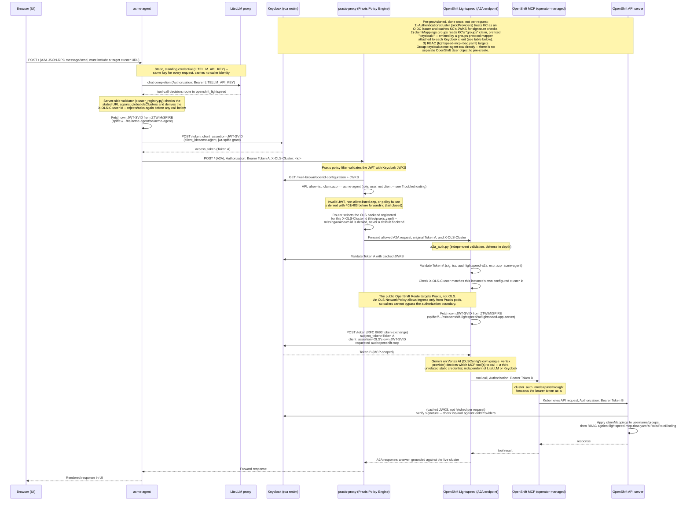
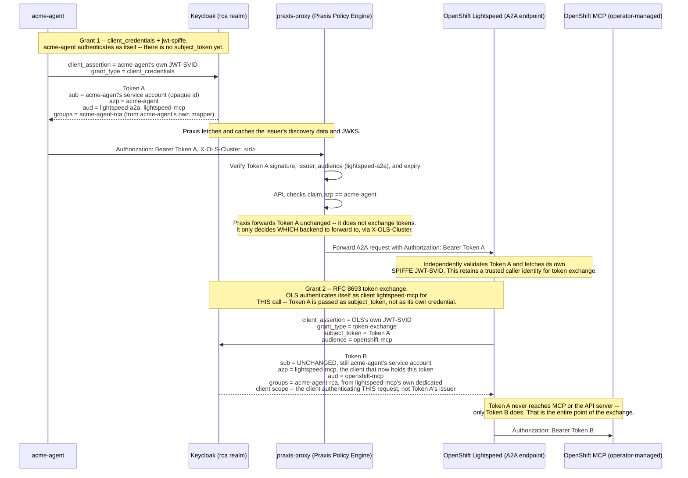

# Authentication flow: ACME UI to OpenShift Lightspeed

This documents the full per-request authentication path from a user typing a
message in the ACME agent's UI through to OpenShift Lightspeed's A2A endpoint
calling the OpenShift MCP server and returning an answer. There is no single
token used end-to-end -- two separate Keycloak grants and one passthrough hop
happen per request, each with its own identity and failure mode, plus a
third, unrelated check (which OpenShift cluster to target) that gates
everything before any of it runs.

## Two unrelated credential systems

It is easy to conflate these because both eventually show up as an
`Authorization` header somewhere, but they answer completely different
questions and must not be confused when debugging:

1. **LLM inference credentials.** ACME's local ADK coordinator (the router
   that picks a downstream sub-agent) always goes through LiteLLM
   (`LITELLM_API_KEY`/`LITELLM_API_BASE`) -- a **static, standing credential
   per deployment**, the same key for every request, unrelated to who's
   asking. It answers "how does ACME's own routing decision authenticate to
   its model backend", and has nothing to do with authorization. If this is
   broken, ACME can't decide anything at all -- it fails before ever
   delegating to OpenShift Lightspeed (see the `litellm.InternalServerError`
   / `Model ... not found` failures in Troubleshooting below, entirely
   independent of Keycloak/SPIFFE). A **second, separate static LLM
   credential** exists one hop further out: OpenShift Lightspeed's own
   `OLSConfig` (`charts/all/openshift-lightspeed-config`) configures a
   `google_vertex` provider (Gemini on Vertex AI) that OLS uses for *its own*
   reasoning and tool-calling -- ACME never sees or authenticates to this
   credential either; it's a different Secret (`ols-llm-creds-vertex`)
   entirely.
2. **Workload/caller identity tokens (SPIFFE JWT-SVID + Keycloak).**
   Everything else in this document. This is **dynamic and per-request**: it
   answers "which identity authorizes this specific tool call, on behalf of
   whom". ACME authenticates to Keycloak as *itself* (its own SPIFFE
   identity) to call OpenShift Lightspeed; Lightspeed's own A2A endpoint then
   authenticates to Keycloak as *itself* again, but the token it requests
   carries the *original caller's* identity as the exchange subject, so the
   eventual MCP tool call is attributable to the caller, not to Lightspeed's
   own service identity. This is the delegation chain that makes "on behalf
   of X" authorization possible, and it is what steps 4-6 of the sequence
   below implement.

In short: the LiteLLM/Vertex keys decide *whether an agent can talk to its
LLM at all*; the SPIFFE/Keycloak chain decides *what the agent is allowed to
do to the cluster, and as whom*. A failure in one never explains a failure in
the other -- that's also why the diagram below draws the LiteLLM proxy as its
own participant instead of folding it into a `Note`.

## Target-cluster selection (gates everything below, not an authorization step)

Before any of the identity chain runs, ACME's root agent requires the user to
state the target OpenShift cluster's API URL explicitly in their message (see
`agents/acme_agent/src/acme_agent/agent.py`'s instruction) -- it never
guesses, reuses a prior URL, or infers a cluster from a resource name. That
prompt alone isn't trustworthy enough to rely on, so a **server-side**
validator (`cluster_registry.py`'s `ClusterRegistry`) independently
canonicalizes the URL and checks it against a GitOps-managed allow-list
(`global.olsClusters` in `variants/standalone/values-standalone.yaml`) before
any downstream call happens at all; `routing.py`'s `ClusterRoutingMiddleware`
runs this check on every inbound `message/send` and returns a JSON-RPC error
directly on rejection -- the ADK agent and its LLM never even run. A valid
URL is turned into a stable, DNS-safe id (e.g.
`https://api.bm-cluster.e2e.bos.redhat.com:6443` ->
`api-bm-cluster-e2e-bos-redhat-com-6443`) that is sent as the `X-OLS-Cluster`
HTTP header on every authenticated A2A call -- bound, per-invocation, to a
`contextvars.ContextVar` so concurrent conversations targeting different
clusters never cross-contaminate (`cluster_context.py`), and never attached
to the public, unauthenticated agent-card fetch.

**This header is a routing hint, not an authorization claim.** It decides
*which* OpenShift Lightspeed backend Praxis forwards to; it grants no rights
by itself. Praxis and OLS both independently re-validate it (reject
missing/unknown, fail closed) and OLS additionally pins it to the task scope
for the duration of a request -- but the actual authorization decision is
made entirely by the Keycloak/SPIFFE chain below, on the cluster the header
selected.

## Sequence


```mermaid
sequenceDiagram
    participant User as Browser (UI)
    participant Acme as acme-agent
    participant LLM as LiteLLM proxy
    participant KC as Keycloak (rca realm)
    participant Praxis as praxis-proxy (Praxis Policy Engine)
    participant OLS as OpenShift Lightspeed (A2A endpoint)
    participant MCP as OpenShift MCP (operator-managed)
    participant API as OpenShift API server

    Note over KC,API: Pre-provisioned, done once, not per request:<br/>1) Authentication/cluster (oidcProviders) trusts KC as an<br/>   OIDC issuer and caches KC's JWKS for signature checks.<br/>2) claimMappings.groups reads KC's "groups" claim, prefixed<br/>   "keycloak:" -- emitted by a groups protocol mapper<br/>   attached to each Keycloak client (see table below).<br/>3) RBAC (lightspeed-mcp-rbac.yaml) targets<br/>   Group:keycloak:acme-agent-rca directly -- there is no<br/>   separate OpenShift User object to pre-create.

    User->>Acme: POST / (A2A JSON-RPC message/send, must include a target cluster URL)

    Note over Acme,LLM: Static, standing credential (LITELLM_API_KEY) --<br/>same key for every request, carries no caller identity
    Acme->>LLM: chat completion (Authorization: Bearer LITELLM_API_KEY)
    LLM-->>Acme: tool-call decision: route to openshift_lightspeed

    Note over Acme: Server-side validator (cluster_registry.py) checks the<br/>stated URL against global.olsClusters and derives the<br/>X-OLS-Cluster id -- rejects/asks again before any call below
    Acme->>Acme: Fetch own JWT-SVID from ZTWIM/SPIRE<br/>(spiffe://.../ns/acme-agent/sa/acme-agent)
    Acme->>KC: POST /token, client_assertion=JWT-SVID<br/>(client_id=acme-agent, jwt-spiffe grant)
    KC-->>Acme: access_token (Token A)

    Acme->>Praxis: POST / (A2A), Authorization: Bearer Token A, X-OLS-Cluster: <id>

    Note over Praxis: Praxis policy filter validates the JWT with Keycloak JWKS
    Praxis->>KC: GET /.well-known/openid-configuration + JWKS
    Praxis->>Praxis: APL allow-list: claim.azp == acme-agent (role: user, not client -- see Troubleshooting)
    Note over Praxis: Invalid JWT, non-allow-listed azp, or policy failure<br/>is denied with 401/403 before forwarding (fail closed).
    Praxis->>Praxis: Router selects the OLS backend registered<br/>for this X-OLS-Cluster id (files/praxis.yaml) --<br/>missing/unknown id is denied, never a default backend
    Praxis->>OLS: Forward allowed A2A request, original Token A, and X-OLS-Cluster

    Note over OLS: a2a_auth.py (independent validation, defense in depth)
    OLS->>KC: Validate Token A with cached JWKS
    OLS->>OLS: Validate Token A (sig, iss, aud=lightspeed-a2a, exp, azp=acme-agent)
    OLS->>OLS: Check X-OLS-Cluster matches this instance's own configured cluster id

    Note over Praxis,OLS: The public OpenShift Route targets Praxis, not OLS.<br/>An OLS NetworkPolicy allows ingress only from Praxis pods,<br/>so callers cannot bypass the authorization boundary.
    OLS->>OLS: Fetch own JWT-SVID from ZTWIM/SPIRE<br/>(spiffe://.../ns/openshift-lightspeed/sa/lightspeed-app-server)

    OLS->>KC: POST /token (RFC 8693 token exchange)<br/>subject_token=Token A<br/>client_assertion=OLS's own JWT-SVID<br/>requested aud=openshift-mcp
    KC-->>OLS: Token B (MCP-scoped)

    Note over OLS: Gemini on Vertex AI (OLSConfig's own google_vertex<br/>provider) decides which MCP tool(s) to call -- a third,<br/>unrelated static credential, independent of LiteLLM or Keycloak
    OLS->>MCP: tool call, Authorization: Bearer Token B
    Note over MCP: cluster_auth_mode=passthrough:<br/>forwards the bearer token as-is
    MCP->>API: Kubernetes API request, Authorization: Bearer Token B
    API->>KC: (cached JWKS, not fetched per request)<br/>verify signature -- check iss/aud against oidcProviders
    API->>API: Apply claimMappings to username/groups,<br/>then RBAC against lightspeed-mcp-rbac.yaml's Role/RoleBinding
    API-->>MCP: response
    MCP-->>OLS: tool result

    OLS-->>Praxis: A2A response: answer, grounded against the live cluster
    Praxis-->>Acme: Forward response
    Acme-->>User: Rendered response in UI
```

## RFC 8693 token exchange, step by step

This is the piece that actually implements "on behalf of X" delegation, and
the piece most likely to break silently if a claim doesn't survive the way
it's expected to. Two full, separate Keycloak grants happen here,
authenticated by two *different* clients -- only one of them determines the
resulting token's subject.


```mermaid
sequenceDiagram
    participant Acme as acme-agent
    participant KC as Keycloak (rca realm)
    participant Praxis as praxis-proxy (Praxis Policy Engine)
    participant OLS as OpenShift Lightspeed (A2A endpoint)
    participant MCP as OpenShift MCP (operator-managed)

    Note over Acme,KC: Grant 1 -- client_credentials + jwt-spiffe.<br/>acme-agent authenticates as itself -- there is no subject_token yet.
    Acme->>KC: client_assertion = acme-agent's own JWT-SVID<br/>grant_type = client_credentials
    KC-->>Acme: Token A<br/>sub = acme-agent's service account (opaque id)<br/>azp = acme-agent<br/>aud = lightspeed-a2a, lightspeed-mcp<br/>groups = acme-agent-rca (from acme-agent's own mapper)

    Note over Praxis,KC: Praxis fetches and caches the issuer's discovery data and JWKS.
    Acme->>Praxis: Authorization: Bearer Token A, X-OLS-Cluster: <id>
    Praxis->>Praxis: Verify Token A signature, issuer, audience (lightspeed-a2a), and expiry
    Praxis->>Praxis: APL checks claim.azp == acme-agent
    Note over Praxis: Praxis forwards Token A unchanged -- it does not exchange tokens.<br/>It only decides WHICH backend to forward to, via X-OLS-Cluster.
    Praxis->>OLS: Forward A2A request with Authorization: Bearer Token A

    Note over OLS: Independently validates Token A and fetches its own<br/>SPIFFE JWT-SVID. This retains a trusted caller identity for token exchange.

    Note over OLS,KC: Grant 2 -- RFC 8693 token exchange.<br/>OLS authenticates itself as client lightspeed-mcp for<br/>THIS call -- Token A is passed as subject_token, not as its own credential.
    OLS->>KC: client_assertion = OLS's own JWT-SVID<br/>grant_type = token-exchange<br/>subject_token = Token A<br/>audience = openshift-mcp
    KC-->>OLS: Token B<br/>sub = UNCHANGED, still acme-agent's service account<br/>azp = lightspeed-mcp, the client that now holds this token<br/>aud = openshift-mcp<br/>groups = acme-agent-rca, from lightspeed-mcp's own dedicated<br/>client scope -- the client authenticating THIS request, not Token A's issuer

    Note over OLS,MCP: Token A never reaches MCP or the API server --<br/>only Token B does. That is the entire point of the exchange.
    OLS->>MCP: Authorization: Bearer Token B
```

**Grant 1 -- acme-agent authenticates as itself** (`client_credentials` +
`jwt-spiffe`; step 3 below has the real captured claim shapes). acme-agent
proves its own workload identity with its own SPIFFE JWT-SVID. There is no
`subject_token` here -- this isn't an exchange, it's acme-agent getting a
token *for itself*. The result, Token A, is attached to the A2A call to the
Praxis public Route, along with `X-OLS-Cluster`. Praxis validates Token A and
its `azp` allow-list, selects the backend the header names, and forwards the
same bearer token to that OpenShift Lightspeed instance; Lightspeed validates
it again so it can use the caller claims as the RFC 8693 `subject_token`.

**Grant 2 -- OLS exchanges Token A for one scoped to OpenShift MCP**
(`urn:ietf:params:oauth:grant-type:token-exchange`). OLS authenticates
*itself* -- as the confidential client `lightspeed-mcp`, with its own SPIFFE
JWT-SVID -- but passes Token A as `subject_token`. This is what makes it an
exchange rather than a fresh grant: **Token B's `sub` is inherited from the
subject_token, not from whoever is authenticating the exchange call.** So
Token B's `sub` is still acme-agent's opaque id, unchanged -- OLS's own
identity never becomes the subject of anything downstream.

`azp` changes across the exchange precisely because it answers a different
question than `sub` does:

| Claim | Answers | Token A | Token B |
| --- | --- | --- | --- |
| `sub` | Whose authority does this token represent? (constant) | acme-agent | acme-agent (unchanged) |
| `azp` | Which client currently holds/may present this token? (changes) | acme-agent | lightspeed-mcp |

This distinction is the entire mechanism that makes delegation meaningful:
authority doesn't shift to whoever happens to be carrying the token at the
moment.

**Does `groups` survive the exchange?** This is the one open question in the
chain, and why the `groups` protocol mapper is attached to *both*
`acme-agent` and `lightspeed-mcp` in `charts/all/keycloak-oidc`. Which
client's mappers apply to a newly-minted token is governed by the client
authenticating *that specific* request -- for Grant 2, that's `lightspeed-mcp`,
not acme-agent (see the comment on `lightspeed-mcp`'s `groups` mapper in
`keycloak-realm-import.yaml` for the full reasoning: a client's
directly-attached `protocolMappers` are its own automatic "dedicated" client
scope, always active with no `scope=` parameter needed). So `lightspeed-mcp`'s
copy is the one that most likely determines whether Token B actually carries
`groups: ["acme-agent-rca"]` -- **confirm this against a real exchanged
token** (see "End-to-end verification" in `charts/all/keycloak-oidc/README.md`)
rather than assuming it; this is the single most consequential unverified
assumption in the whole flow, since RBAC (`lightspeed-mcp-rbac.yaml`) keys on
it entirely.

**No `act` claim.** RFC 8693 defines an `act` (actor) claim for exactly this
"X's authority, exercised by Y" case. Keycloak's *standard* (V2) token
exchange -- what's enabled on this cluster -- does not populate it; that
requires Keycloak's separate "Token Exchange Delegation" feature (a
`delegation:client` client scope plus its own Fine-Grained Admin Permissions
v2 grant), which this repo does not enable. The only actor information
available in practice is `azp` -- audit the actor by correlating `azp` with
OLS's own A2A request logs (`a2a_auth.py` logs `sub`/`azp` at debug level,
never the raw token).

**Token A never reaches MCP or the API server.** Only Token B does. That's
the actual point of the exchange: neither MCP nor the Kubernetes API server
ever sees the raw caller token -- they only ever see one scoped specifically
to the `openshift-mcp` audience, and only OLS's A2A endpoint ever sees both.
`a2a.py` explicitly rejects any client-supplied `MCP-Headers` override (both
as an HTTP header and as a JSON-RPC param), so a caller cannot substitute its
own MCP credential for the exchanged one either.

## Keycloak <-> OpenShift group mapping (pre-provisioned, not per-request)

The API server never calls Keycloak "live" to ask whether a token is
authorized -- everything below is configured once by `charts/all/keycloak-oidc`
and then only read from cache on the hot path:

1. **Trust**: `Authentication/cluster`'s `spec.oidcProviders[0]` (rendered by
   `templates/openshift-authentication.yaml`) names Keycloak's realm issuer
   URL and fetches/caches its JWKS for signature verification. Any audience a
   token was issued for must be listed in `issuer.audiences`
   (`keycloak.clientId`, `keycloak.consoleClientId`, plus
   `openshiftOIDC.extraAudiences` -- this is exactly the `openshift-mcp` gap
   covered in Troubleshooting/step 5 below).
2. **Claim mapping**: `claimMappings.groups.claim` (`openshiftOIDC.groupsClaim`,
   default `groups`) tells the API server which token claim carries group
   membership, and `claimMappings.groups.prefix` (`openshiftOIDC.groupsPrefix`,
   default `keycloak:`) is prepended to every value. The `groups` claim itself
   only appears in a token if the *client that issued it* has a `groups`
   protocol mapper attached -- there is no realm-wide default, which is
   exactly the console/CLI gotcha in Troubleshooting below.

   The prefix is deliberate, not cosmetic: an **empty** prefix would let a
   Keycloak-sourced group value collide with a Kubernetes **reserved
   `system:`-namespaced group** (e.g. `system:masters` grants cluster-admin)
   if a group in Keycloak was ever named that, by mistake or otherwise.
   `keycloak:` makes that structurally impossible -- no claim value coming
   through this path can ever produce a bare `system:...` group name. Don't
   remove it to match examples that use an empty prefix.

3. **RBAC**: bindings such as `admin-rbac.yaml`'s
   `<adminGroupName>-cluster-admin` `ClusterRoleBinding` target
   `Group:keycloak:<adminGroupName>` directly, and
   `lightspeed-mcp-rbac.yaml`'s `Role`/`RoleBinding` pair targets
   `Group:keycloak:acme-agent-rca` the same way. There is no separate
   OpenShift `User`/`Group` object to provision -- the prefixed claim value
   *is* the RBAC subject the moment a valid token presents it.

`lightspeed-mcp-rbac.yaml` grants the mapped group exactly `get`/`list` on
`pods` and `events`, in exactly the namespaces listed under
`lightspeedRbac.namespaces` -- no pod logs, no Secrets, no RBAC objects, no
write verbs by default (see `LIGHTSPEED_DESIGN.md`'s "Rights to
grant (and not grant)" section). OpenShift RBAC is the final, authoritative
allow/deny for every Kubernetes API call MCP makes on Token B's behalf;
there is no namespace-scoping admission policy layered on top of it the way
the old `AgenticRun`-based flow had -- OLS's own tool-calling loop decides
which Kubernetes objects to look at, and RBAC alone decides whether the
mapped identity may see them.

The one manual, one-time step this doesn't template (Keycloak-version-specific
UI, see `charts/all/keycloak-oidc/README.md`): creating the actual Keycloak
group (e.g. `cluster-admins`) and adding users to it. Everything downstream of
that -- the claim appearing in tokens, the API server trusting it, and RBAC
resolving it -- is what steps 1-3 above wire up automatically.

## The five Keycloak clients

Defined by `charts/all/keycloak-oidc`, in the `rca` realm. Conflating any of
these breaks the flow -- see that chart's README for the exact rationale.

| Client | Type | Used by | Purpose |
| --- | --- | --- | --- |
| `openshift-cli` | public | Browser / `oc login` | Native OIDC login only, unrelated to the agent request flow. Registered as the `cli` OIDC platform client. Cannot authenticate itself. |
| `openshift-console` | confidential | Web console | Registered as the `console` OIDC platform client. Needs the `groups` protocol mapper (see Troubleshooting) or RBAC group membership never reaches the console. |
| `acme-agent` | confidential | acme-agent | Client-credentials-style grant authenticated with acme-agent's own SPIFFE JWT-SVID (`client_assertion_type=urn:ietf:params:oauth:client-assertion-type:jwt-spiffe`) instead of a static secret. Its service account belongs to the `acme-agent-rca` group, so its tokens carry a `groups` claim RBAC can key on. |
| `lightspeed-mcp` | confidential | OpenShift Lightspeed's A2A endpoint | RFC 8693 token exchange: takes the caller's token as `subject_token`, authenticates itself with its own SPIFFE JWT-SVID, and requests a token scoped to the `openshift-mcp` audience. |
| `openshift-mcp` | confidential | (never authenticates) | Exists only so `lightspeed-mcp`'s exchange has a real `client_id` to name as its `audience` -- Keycloak's standard token exchange requires that parameter to be an actual client. |

There is also a sixth, deliberately-not-a-client value:
`keycloak.lightspeedA2aAudience` (default `lightspeed-a2a`), the audience
OLS's own inbound `KeycloakTokenValidator` (`a2a_auth.py`) requires. Unlike
`openshift-mcp` above, nothing in Keycloak requires this to correspond to a
real client -- it's added to acme-agent's token via `oidc-audience-mapper`'s
`included.custom.audience` (a plain string), not `included.client.audience`.

`acme-agent` and `lightspeed-mcp` authenticate via Keycloak's federated
client authentication feature against the `spiffe` identity provider this
chart also creates -- fully declarative
(`keycloak.spiffeIdentityProvider.*`/`clientAuthenticatorType: federated-jwt`
in `charts/all/keycloak-oidc`), no manual Admin Console step required. See
that chart's README for the exact mechanics, including two non-obvious
requirements this doc's Troubleshooting section below also covers: the
`client_id` form parameter must be omitted from these requests, and the
SPIFFE JWT-SVID used as `client_assertion` must be requested with the
Keycloak realm issuer URL as its audience, not the workload's own name.

## Per-hop identity and validation

Every JWT sample below is illustrative -- field names and the exact claim set
depend on this realm's protocol mappers, not a spec all Keycloak realms share
-- but the shapes match what this repo's charts actually configure. Watch
`sub`/`azp`/`aud` change hop to hop; that's the whole "who, calling what, on
whose behalf" story in one column.

1. **User to acme-agent**: no authentication by default (`auth.mode` on
   the caller-facing side is out of scope here -- this doc covers the
   *downstream* auth acme-agent performs, not who's allowed to open the
   UI). No token exists yet, which matters below: nothing upstream of step 3
   ever identifies the human at the keyboard. The user must, however, state
   an explicit target cluster URL before anything below runs (see
   "Target-cluster selection" above) -- a missing/ambiguous URL stops the
   request here with a clarifying question, not a token failure.
2. **acme-agent to LiteLLM** (`agents/acme_agent/src/acme_agent/agent.py`,
   `_model()`): every reasoning step of the local ADK coordinator (including
   the decision to route to `openshift_lightspeed`) goes through
   `LiteLlm(base_url=..., api_key=...)`, populated from
   `LITELLM_API_BASE`/`LITELLM_API_KEY` -- a static credential from
   acme-agent's own `litellm.credentialsSecretName` Secret, unrelated to the
   caller and to steps 3-8 below.

   ```
   Authorization: Bearer sk-litellm-REDACTED
   ```

   Opaque, not a JWT -- there is nothing to decode. This key identifies the
   *deployment*, not any caller; the same value is sent for every request.
3. **acme-agent to OpenShift Lightspeed** (`agents/acme_agent/src/acme_agent/auth.py`,
   `DownstreamAuth`): fetches a JWT-SVID from the SPIFFE Workload API for
   audience `identity.keycloak.issuerUrl` (the Keycloak realm issuer --
   *not* `acme-agent`; see Troubleshooting), uses it as `client_assertion`
   in a Keycloak `client_credentials` token request for the confidential
   `acme-agent` client (with no `client_id` form parameter -- also see
   Troubleshooting), and attaches the resulting access token as
   `Authorization: Bearer` on every outbound A2A request, plus
   `X-OLS-Cluster: <id>` on every authenticated POST (`httpx` `event_hooks`;
   `add_cluster_header` checks the HTTP method itself so the routing header
   never reaches the public, unauthenticated agent-card fetch).

   Real captured shape (illustrative field values; verify `groups` against a
   live token before relying on it, same caveat as the Grant 2 section
   above):

   ```json
   {
     "iss": "https://keycloak.apps.<cluster-domain>/realms/rca",
     "sub": "0e844946-0456-475b-9265-e17532b362c9",
     "azp": "acme-agent",
     "aud": ["lightspeed-a2a", "lightspeed-mcp", "account"],
     "preferred_username": "service-account-acme-agent",
     "groups": ["acme-agent-rca"],
     "scope": "email profile",
     "exp": 1790256558,
     "iat": 1790256258
   }
   ```

   **This is the token that ends up as "on behalf of" for the rest of the
   chain.** Because step 1 authenticates no one, `sub` here is
   acme-agent's own service account, not the human using the UI --
   everything downstream is attributable to acme-agent-as-caller, not to
   an end user. Note `sub` is an opaque internal user id, not the readable
   `service-account-acme-agent` string (that only appears in
   `preferred_username`). If per-user attribution is ever needed, a user
   identity has to be captured before this hop and folded into this token
   (e.g. a second token exchange).
   `lightspeed-a2a`/`lightspeed-mcp` both appear in `aud` because OLS's own
   inbound check needs `lightspeed-a2a` (a plain custom-audience string, no
   client behind it -- `keycloak.lightspeedA2aAudience`), and Keycloak's
   standard token exchange (step 6) separately requires the subject_token to
   already carry the exchanging client (`lightspeed-mcp`, a real client
   audience this time) as an audience -- both are protocol mappers on the
   `acme-agent` client, see `charts/all/keycloak-oidc`.
4. **OLS validates the inbound token** (`vendor/lightspeed-service/ols/app/endpoints/a2a_auth.py`,
   `A2AAuthenticator.authenticate_caller`): every A2A JSON-RPC call requires
   (a) `KeycloakTokenValidator.validate` -- signature via JWKS, issuer, the
   `lightspeed-a2a` audience, expiry, and `azp == acme-agent` -- and (b) a
   valid, allow-listed `X-OLS-Cluster` header matching this instance's own
   configured cluster id. Either failing returns `401` (invalid/missing
   token) or `403` (missing/unknown cluster header); the stock REST API
   (`/v1/*`) is completely unaffected -- it keeps using Kubernetes
   `TokenReview`/`SubjectAccessReview` via `ols.src.auth.k8s`, a separate
   trust boundary this A2A path does not touch.

   ```
   Checks run against the step-3 token by KeycloakTokenValidator.validate():
     iss == A2A_KEYCLOAK_ISSUER_URL   (https://keycloak.../realms/rca)
     aud == A2A_INBOUND_AUDIENCE      ("lightspeed-a2a")
     azp == A2A_INBOUND_AZP           ("acme-agent")
     exp/iat/sub required, signature verified via JWKS
   ```

   OLS's own JWT-SVID, fetched independently of the caller token. `aud` is
   the Keycloak realm issuer, same reasoning as step 3 -- this JWT-SVID's
   only consumer is the `client_assertion` on the exchange in step 6 below:

   ```json
   {
     "sub": "spiffe://apps.<cluster-domain>/ns/openshift-lightspeed/sa/lightspeed-app-server",
     "aud": ["https://keycloak.apps.<cluster-domain>/realms/rca"],
     "exp": 1732000300
   }
   ```
5. **OLS's own reasoning** (OLSConfig's `google_vertex` provider, Gemini on
   Vertex AI): a *different*, static credential (`ols-llm-creds-vertex`
   Secret), used by OLS's existing query/tool pipeline
   (`ols.app.endpoints.ols.generate_response`) to decide which MCP tool(s) to
   call for this query. Never the caller's Keycloak token; unrelated to
   ACME's LiteLLM credential in step 2.
6. **OLS to OpenShift MCP** (`a2a_auth.py`'s `KeycloakTokenExchanger` +
   `a2a.py`'s `_handle_send_message`): the caller's *validated* token is used
   only as the `subject_token` of an RFC 8693 exchange -- it is never
   forwarded to MCP itself. OLS authenticates the exchange call with its own
   JWT-SVID as `client_assertion` on the confidential `lightspeed-mcp`
   client, requesting the `openshift-mcp` audience
   (`A2A_EXCHANGE_AUDIENCE`). The resulting MCP-scoped token (Token B) is
   passed as the `user_token` argument into OLS's existing
   `generate_response` call for this request -- never a client-supplied
   `MCP-Headers` override, which `a2a.py` explicitly rejects.

   ```
   Token-exchange request (KeycloakTokenExchanger.exchange):
     grant_type=urn:ietf:params:oauth:grant-type:token-exchange
     subject_token=<step 3's access token>
     subject_token_type=urn:ietf:params:oauth:token-type:access_token
     requested_token_type=urn:ietf:params:oauth:token-type:access_token
     client_assertion_type=urn:ietf:params:oauth:client-assertion-type:jwt-spiffe
     client_assertion=<OLS's own JWT-SVID from step 4>
     audience=openshift-mcp
   ```

   No `client_id` here either, same reason as step 3. Real captured shape
   (`groups` is expected from the `acme-agent-rca` mapper -- **not yet
   independently re-verified live**; whether Keycloak's standard V2 exchange
   re-runs the subject's own protocol mappers for the new audience, or only
   the audience client's, is the thing to confirm):

   ```json
   {
     "iss": "https://keycloak.apps.<cluster-domain>/realms/rca",
     "sub": "0e844946-0456-475b-9265-e17532b362c9",
     "aud": ["openshift-mcp"],
     "azp": "lightspeed-mcp",
     "preferred_username": "service-account-acme-agent",
     "groups": ["acme-agent-rca"],
     "exp": 1790256632
   }
   ```

   - **`sub` -- whose authority is this?** Carried over unchanged from the
     subject token (step 3): acme-agent's service account (the same
     opaque id, not OLS's own). This is what "on behalf of X" means in this
     flow: **X is the subject being represented**, not the agent doing the
     representing.
   - **`azp` -- who is this specific token issued to / allowed to present
     it?** `lightspeed-mcp`: the client that called the token endpoint, so
     it is the party the resulting token is handed to.
   - **No `act` claim.** See the "No `act` claim" callout in the RFC 8693
     section above -- the only actor information available in practice is
     `azp`.
7. **OpenShift MCP to the API server**: `cluster_auth_mode=passthrough`
   (the operator-managed MCP server's hardening configuration, see
   `charts/all/openshift-lightspeed-config/README.md`'s "MCP hardening"
   section for what is and isn't confirmed here) means MCP does no
   authorization decision itself -- it forwards the MCP-scoped bearer token
   straight through to the Kubernetes API server as the caller's own
   credential. The API server's own OIDC authenticator (via
   `Authentication/cluster`) makes the actual RBAC decision by validating the
   token against its cached Keycloak JWKS and then applying `claimMappings`
   (see "Keycloak <-> OpenShift group mapping" above) -- it does not call
   Keycloak per request. This means `openshift-mcp` **must** be one of
   `Authentication.spec.oidcProviders[].issuer.audiences`
   (`openshiftOIDC.extraAudiences` in `charts/all/keycloak-oidc`) or every
   MCP call is rejected at this hop even though the token exchange in step 6
   succeeded cleanly.

   ```
   claimMappings applied to the step-6 token:
     username: claim "sub"    -> "keycloak:0e844946-0456-475b-9265-e17532b362c9"
     groups:   claim "groups" -> ["keycloak:acme-agent-rca"] (expected --
                                  see the "not yet independently re-verified
                                  live" note on the step-6 sample above)
   ```

   `lightspeed-mcp-rbac.yaml`'s `Role`/`RoleBinding` pair grants exactly this
   mapped group `get`/`list` on `pods`/`events` in the namespaces listed
   under `lightspeedRbac.namespaces` -- nothing else. There is no
   namespace-scoping admission policy layered on top of RBAC the way the old
   `AgenticRun`-based flow had; OpenShift RBAC is the sole, final authority
   on every Kubernetes API call MCP makes.
8. **OLS returns the answer**: unlike the old `AgenticRun`/`AnalysisResult`
   polling loop, OLS answers synchronously within the same `SendMessage`
   call -- there is no separate operator watching a custom resource and no
   polling round-trip. Task/conversation state is scoped to `(authenticated
   caller, cluster id)` (`CallerIdentity.task_scope`) and held in-process
   only (`a2a.py`'s `_tasks` dict, pruned after 10 minutes) -- it does not
   survive a restart or span replicas, which matches this phase's scope: a
   persistent, multi-replica-safe task store is tracked as later work (see
   the migration plan's Praxis task-owner routing discussion). If OLS's
   output needs to be structured (a diagnosis + remediation-proposal
   contract equivalent to the old `AnalysisResult`), that is a still-open
   product question -- see `LIGHTSPEED_IMPLEMENTATION_PLAN.md`'s "AnalysisResult
   parity decision" task.

## Tracing a live request

Each hop fails independently and mostly silently (generic `401`s are
deliberate), so trace hop-by-hop rather than end-to-end:

```bash
# 1. acme-agent's outbound call, its own SPIFFE fetch, and cluster-URL
#    validation (rejections happen here, before any network call below)
oc logs -n acme-agent -l app.kubernetes.io/name=acme-agent -f

# 2. Praxis ingress authorization and header-based routing -- a deny or a
#    routing-to-the-wrong-backend decision here means OLS never received
#    the request at all
oc logs -n praxis-proxy -l app.kubernetes.io/name=praxis-proxy -f

# 3. OLS's inbound validation, its own SPIFFE fetch, and the token-exchange
#    call (A2A-specific; separate from the stock /v1 REST auth path)
oc logs -n a2a-lightspeed -l app.kubernetes.io/component=application-server -f

# 4. Keycloak's own record of every grant/exchange against a client --
#    enable this once: Admin Console -> Realm Settings -> Events -> Save Events
#    then Realm -> Sessions / Events, filtered by client (acme-agent,
#    lightspeed-mcp)

# 5. The passthrough hop -- MCP does no authz itself, so any 401/403 here
#    is really the API server rejecting the forwarded token
oc logs -n a2a-lightspeed -l app.kubernetes.io/component=mcp-server -f

# 6. What the API server currently trusts
oc get authentication.config.openshift.io cluster -o jsonpath='{.spec.oidcProviders[0].issuer.audiences}'

# 7. Whether RBAC is why an MCP call was denied (impersonation pre-check,
#    not a substitute for inspecting a real exchanged token's claims --
#    see charts/all/keycloak-oidc/README.md's "End-to-end verification")
oc auth can-i get pods --as=nobody --as-group=keycloak:acme-agent-rca -n <namespace>
```

## Troubleshooting (bugs actually hit building this)

- **`litellm.InternalServerError: ... Missing credentials`, or `Model
  openai/... not found`**: this is the *LLM inference* credential (see
  above), not the SPIFFE/Keycloak chain -- don't go looking in Keycloak
  Events for this one. `LiteLlm` forwards `**kwargs` straight to
  `litellm.completion()`, which does not read `LITELLM_API_BASE`/
  `LITELLM_API_KEY` on its own; those are this repo's own env var names, not
  something litellm auto-detects for the `openai/` model prefix (it only
  auto-reads `OPENAI_API_KEY`). `agent.py` must pass them explicitly as
  `base_url=`/`api_key=` kwargs to `LiteLlm(...)` -- note the kwarg is
  `base_url`, not `api_base`.
- **OLS's MCP calls get 401 despite a successful token exchange**: check
  step 7 above -- `openshift-mcp` must be in the trusted audiences list, not
  just the two OIDC platform client IDs.
- **Console/CLI users authenticate but land in no RBAC groups**: the
  `openshift-console` client needs its own `groups` protocol mapper. It is
  easy to add the mapper only to the public login client (`openshift-cli`) and
  forget the console has a separate client with its own, independent set of
  protocol mappers.
- **acme-agent logs `Failed to resolve remote A2A agent openshift_lightspeed:
  Agent card URL must use https, or http on a loopback host:
  http://...`**: this is neither Keycloak nor SPIFFE -- google-adk's
  `RemoteA2aAgent` refuses to fetch an agent card (and, separately, refuses
  to trust the RPC url *inside* a card it did fetch) over plain http on a
  non-loopback host. The in-cluster Service DNS name is non-loopback plain
  http, so it no longer qualifies once a real caller in a different pod
  resolves it. Fix: route through Praxis's edge-TLS Route (`route.enabled`)
  and set `a2a.remoteAgents[0].endpoint` to that route's https origin, never
  an in-cluster Service DNS name.
- **acme-agent logs a 401 from Keycloak's `/token` endpoint while fetching
  OpenShift Lightspeed's agent card** (the https error above is fixed, but
  the fetch itself then 401s): the agent card fetch is unauthenticated, but
  acme-agent's httpx client attaches its Keycloak bearer token to *every*
  outbound request via an event hook -- so this is actually the
  client_credentials + jwt-spiffe grant failing, not the card fetch. Reproduce
  directly against Keycloak's token endpoint from inside the pod (fetch a
  JWT-SVID via `spiffe.WorkloadApiClient`, POST it as `client_assertion`) to
  see the real Keycloak error body instead of a generic httpx exception. In
  order encountered, debugging this surfaced three separate, unrelated causes
  -- all now fixed in the charts, but worth knowing if this ever regresses:
  - `{"errorMessage":"Invalid trust domain name"}` when creating the `spiffe`
    identity provider via the Admin REST API with `config.trustDomain` set:
    on Keycloak 26.4.16 (RHBK), `SpiffeIdentityProviderConfig.getTrustDomain()`
    actually reads the generic `config.issuer` key, not `config.trustDomain`
    -- upstream `main` renamed this field, but this repo's Keycloak build
    predates that rename. `charts/all/keycloak-oidc` now emits `issuer`.
  - `{"error":"unauthorized_client","error_description":"Invalid client or
    Invalid client credentials"}`: the `spiffe` identity provider referenced
    by `jwt.credential.issuer` didn't exist in the realm at all. Now
    templated in `charts/all/keycloak-oidc/templates/keycloak-realm-import.yaml`'s
    `identityProviders` list.
  - `{"error":"invalid_client","error_description":"client_id parameter does
    not match sub claim"}`: both agents' code sent a `client_id` form
    parameter alongside `client_assertion`. Keycloak's generic JWT client
    validator (`AbstractJWTClientValidator.validateClient`) rejects the
    request outright whenever `client_id` is present and differs from the
    assertion's `sub` -- and for a SPIFFE assertion `sub` is always a SPIFFE
    ID, never the Keycloak client_id, by design. Fixed by omitting `client_id`
    entirely in `acme_agent/auth.py`'s `_keycloak_token()` and
    `a2a_auth.py`'s `KeycloakTokenExchanger.exchange()` -- the client is
    resolved from the assertion's `sub` instead.
  - Also relevant once the above three are fixed: the SPIFFE JWT-SVID used as
    `client_assertion` must be requested with **the Keycloak realm issuer
    URL** as its audience (`SPIFFE_JWT_AUDIENCE`/`A2A_SPIFFE_JWT_AUDIENCE`) --
    `FederatedJWTClientValidator.getExpectedAudiences()` defaults to
    `Urls.realmIssuer(...)` when no explicit audience list is configured.
    Requesting an audience like `acme-agent` (the workload's own name) fails
    this check.
- **OLS's token exchange succeeds but the resulting token's `aud` doesn't
  contain the requested audience** (or the exchange is rejected as
  unavailable): Keycloak's *standard* (V2) token exchange audience parameter
  only **filters** audiences the exchanging client's own protocol mappers
  already resolve -- it never adds one that wasn't already resolvable. Three
  things must all be true, and this repo's chart templates them together so
  they don't drift apart: (1) `lightspeed-mcp` needs the client attribute
  `standard.token.exchange.enabled: "true"` (V2 exchange is opt-in per
  client), (2) `lightspeed-mcp` needs its own protocol mapper adding
  `openshift-mcp` as an audience (`included.client.audience: openshift-mcp`),
  and (3) `openshift-mcp` must exist as an actual client in the realm -- the
  `audience` request parameter must name a real `client_id`, it cannot be an
  arbitrary string. Separately, (4) the *subject_token* being exchanged
  (acme-agent's token from step 3) must already carry `lightspeed-mcp` as
  an audience, or the exchange is rejected outright regardless of the above.
- **acme-agent's calls to OpenShift Lightspeed now get a generic `401` or
  `403` after previously working**: inspect `praxis-proxy` logs first. Its
  embedded Praxis Policy Engine validates the Keycloak JWT and applies the
  APL allow-list before forwarding; unknown clients and identity/policy
  errors fail closed. Confirm `policy.allowedCallers` in
  `charts/all/praxis-proxy/values.yaml` includes the token's `azp`, the
  issuer and audience match the token (`identity.keycloak.audience` must be
  `lightspeed-a2a`, not an old `rca-agent`-era value), and the Praxis pod can
  fetch Keycloak's JWKS. If Praxis reports `no public address` or `private
  address (RFC 1918)`, enable its `policy.allowPrivateIdp` only for the
  static issuer configuration; if it reports `UnknownIssuer`, configure
  `policy.caBundleSync` so the proxy trusts the managed ingress CA. These are
  separate egress and TLS-trust checks. If the proxy allows the request but
  OLS rejects it, inspect OLS's own logs next (step 3 above): it
  independently validates the same bearer token and its own SPIFFE workload
  identity. Also verify OLS's NetworkPolicy admits the Praxis pod selector;
  do not disable it to work around a selector mismatch, since that would
  restore a direct path around the proxy.
- **Praxis's policy allow-list silently admits every caller, not just the
  allow-listed one, even though `policy.allowedCallers` is set correctly**:
  this is the pinned Praxis image's own defect, not a config mistake, and it
  was found and fixed building this flow -- see the long comments on the
  `jwt-client` plugin's `role` field and the catch-all route in
  `charts/all/praxis-proxy/files/policy.yaml` for the full empirical
  write-up. Two independent causes, both on `ghcr.io/praxis-proxy/ai:0.4.1`
  (embedded Praxis Policy Engine 0.3.1): (1) with `role: client` (the
  semantically "correct" role for an OAuth client/service-account token),
  the resulting `client.*` claim bag never becomes visible to route
  predicates in this build regardless of granted capabilities --
  `exists(client.claim.azp)` evaluates false for a token that demonstrably
  has `azp` set. `role: user` populates `subject.*`/`claim.*` instead, and
  those *are* visible. (2) a bare predicate with no explicit action (e.g.
  `"claim.azp == 'acme-agent'"` on its own) is a documented no-op
  fallthrough in this engine's effects model, not an implicit allow/deny --
  and wrapping it in `require(...)` is *separately* broken on this exact
  build (observed to deny unconditionally regardless of the claim compared).
  The only form verified to work is `role: user` plus an explicit
  `deny(...)` action on the negated condition (`claim.azp != '<allowed>':
  deny(...)`) -- which is what the chart renders now. Revalidate both quirks
  before relying on either form again on a future Praxis image.
- **Praxis's policy denies a request with `claim.azp` undefined even though
  the decoded token clearly has an `azp` claim**: a *different*, now-fixed
  bug from the one above, worth knowing if it resurfaces on a future image.
  The `identity/jwt` plugin's `claim_mapper` (`keycloak` and `standard`
  presets alike) is documented to normalize the client claim -- `azp`,
  `client_id`, or the pre-2023 Keycloak `clientId` -- into one mapped field
  named `client_id`; `azp` is only ever an input candidate to that mapping,
  never the field name APL sees. On the pinned build, however, that mapped
  `client_id` field was never actually visible to route predicates either
  (see the `role: client` note above) -- so compare the raw `claim.azp`
  value directly (available via `role: user` + `read_claims`), not a mapped
  field, regardless of which claim_mapper preset is configured.
- **acme-agent logs `Failed to resolve remote A2A agent openshift_lightspeed:
  ... [SSL: CERTIFICATE_VERIFY_FAILED] certificate verify failed: unable to
  get issuer certificate`** fetching Praxis's agent card, or the
  `rca-realm-secrets-reconciler` PostSync Job hits the identical error
  against Keycloak's own issuer URL: both used
  `ssl.create_default_context(cafile=ca_bundle)` (or httpx's
  `verify=<path>`, which does the same thing internally) to trust the
  synced managed-ingress-CA bundle -- this *replaces* the default trust
  store with only that bundle instead of adding to it. Harmless when the
  cluster's ingress uses a self-signed internal CA (a single root cert is
  trust anchor enough on its own), but this specific cluster's ingress
  certificate is issued by a real public CA (ZeroSSL, chaining through
  Sectigo to a USERTrust root) and the synced bundle only contains the
  leaf's intermediate certificates, not the actual trusted root -- so the
  chain can never complete no matter how valid the certificate actually is.
  Fixed everywhere this pattern was used for a connection that could ever
  hit a public-CA-signed endpoint (`acme_agent/auth.py`'s
  `_tls_context_trusting`, `charts/all/keycloak-oidc`'s
  `realm-secrets-reconciler-job.yaml`) by calling
  `ssl.create_default_context()` first (keeps public-CA trust) and layering
  the custom bundle on top via `load_verify_locations()`. Not changed in the
  CA-sync scripts themselves (`sync_keycloak_ca.py`/`sync_ingress_ca.py`) or
  the new `appServerPatch`'s `patch_appserver.py`, since those only ever
  talk to the in-cluster Kubernetes API server, whose certificate always
  chains to exactly the projected service-account CA -- an exclusive
  `cafile=` there is correct, not a latent copy of this bug.
- **OLS's RFC 8693 exchange gets a `401 Unauthorized` from Keycloak's
  `/token` endpoint** with no detail beyond "Keycloak token exchange for
  OpenShift MCP failed" (OLS validates and uses the caller's token fine up
  to this point -- the SPIFFE JWT-SVID fetch itself succeeds, so this is
  *not* the SPIRE/ZTWIM issue above): check whether
  `keycloak.lightspeedWorkload.namespace`/`serviceAccount` was ever changed
  **after** the realm already imported. `keycloak-realm-import.yaml`
  templates `lightspeed-mcp`'s `jwt.credential.sub` attribute (the exact
  SPIFFE ID the federated-jwt validator requires the `client_assertion`'s
  `sub` claim to match) from those two values at import time only -- the
  same one-shot limitation documented elsewhere in this file for
  `adminGroupName`/`consoleClientSecretVaultKey`. Moving the OLS app-server
  to a different namespace (done in this pattern specifically to dodge
  ZTWIM's `ignoreNamespaces: ["openshift-*"]`, see the SPIRE/ZTWIM entry
  above) changes the real JWT-SVID's `sub` to the new namespace, but
  `lightspeed-mcp`'s already-imported `jwt.credential.sub` keeps pointing at
  the old one -- Keycloak's federated-jwt validator doesn't know the
  presented assertion's subject, so it rejects it outright. Confirmed by
  comparing the live client's attribute (Admin REST API:
  `GET /admin/realms/rca/clients?clientId=lightspeed-mcp`) against the
  actual JWT-SVID's decoded `sub` claim -- they'd drifted. Fix via the
  Admin REST API directly (`PUT` the client with the corrected
  `attributes["jwt.credential.sub"]`); a future full realm re-import would
  also pick up the new value, but re-importing an existing realm isn't
  something this pattern's chart does today.
